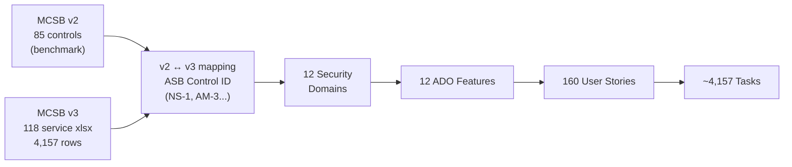

[[_TOC_]]

# Azure Infrastructure Security Gap Assessment — Delivery Approach

## Executive Summary

This wiki documents the approach used to build a structured Azure Infrastructure Security Gap Assessment based on the Microsoft Cloud Security Benchmark (MCSB) v2 and v3 frameworks. The assessment has been decomposed into 12 security domains, 160 user stories, and a data-driven effort model validated against industry benchmarks.

**Current effort estimate: 696h / 87 working days** across all 12 domains (pre-reclassification baseline; see Section 8 for domain breakdown and Section 9 for refinement in progress).

**Audience**: team management, engineering leads, and security stakeholders preparing delivery planning and sprint allocation.

---

## Assessment Scope

### Source Frameworks

| Framework | Version | Content |
|---|---|---|
| MCSB | v2 | 85 benchmark controls, resource-agnostic, 12 security domains |
| MCSB | v3 (per-service) | 118 Azure service baselines, ~35 feature rows each, 4,157 total rows |

### Security Domains in Scope

| Code | Domain |
|---|---|
| NS | Network Security |
| IM | Identity Management |
| PA | Privileged Access |
| DP | Data Protection |
| AM | Asset Management |
| LT | Logging and Threat Detection |
| IR | Incident Response |
| PV | Posture and Vulnerability Management |
| ES | Endpoint Security |
| BR | Backup and Recovery |
| DS | DevOps Security |
| GS | Governance and Strategy |

### Work Item Totals

- **12 Features** — one per security domain
- **160 User Stories** — MCSB controls mapped per resource
- **~4,157 Tasks** (planned) — one per v3 control-feature row

### Framework Relationship



---

## ADO Work Item Hierarchy

### Design Decision

| Work Item Type | Count | Maps To |
|---|---|---|
| **Feature** | 12 | Security domain (NS, IM, PA, DP, AM, LT, IR, PV, ES, BR, DS, GS) |
| **User Story** | 160 | MCSB control instance per Azure resource |
| **Task** | ~4,157 | Script or manual check per v3 control-feature row |

### Rationale

- **Domain = Feature**: 12 domains fit naturally at Feature level. Epics would add unnecessary nesting for a single-team engagement. Feature-level granularity gives management visibility per security domain on the ADO board.
- **Control = User Story**: Each user story represents one auditable control for one Azure resource. Stories carry acceptance criteria (policy confirmed / uncertain / gap) making done-criteria explicit.
- **Feature row = Task**: Each row in the v3 per-service xlsx is one verifiable check (scripted or manual). Tasks are generated from `v3_service_controls_reclassified.csv`.

### Feature Naming Convention

```
Security Domain #N: {Name} ({CODE}) Baselines
```

Example: `Security Domain #1: Network Security (NS) Baselines`

---

## v2 → v3 Mapping Approach

### Framework Definitions

- **MCSB v2**: 85 benchmark controls in a single definition file (`azure-security-benchmark-v3.0.xlsx`). Resource-agnostic — defines *what* to check, not *how* per service.
- **MCSB v3**: 118 per-service baseline files (one per Azure service). Each file has a "Feature Summary" sheet with rows mapping back to v2 control IDs via the `asb_control_id` field (same ID scheme: NS-1, AM-3, etc.).

### Story Types

| Type | Count | % | Definition |
|---|---|---|---|
| Combined v2+v3 | 118 | 74% | v2 control with ≥1 Azure resource having v3 data |
| Pure v2 | 42 | 26% | v2 control with no v3 resource baseline (process/org controls) |

### Mapping Key

`v2 control_id` = `asb_control_id` in v3 xlsx. Same identifier across both versions (e.g., `NS-1`, `AM-3`, `ES-2`). This shared key enables exact join without fuzzy matching at the control level.

### Source Files

- v3 xlsx source: `MicrosoftDocs/SecurityBenchmarks / Azure Offer Security Baselines / 3.0`
- Downloaded and cached locally: `data/inputs/v3_baselines/` (118 files, gitignored — tenant-adjacent data)
- Merged output: `data/outputs/v3_service_controls_raw.csv` (4,157 rows)

---

## User Story Structure

### Format

Stories use ADO-native markdown. Not BDD (Given/When/Then removed by design — assessment framing, not enforcement framing).

### Story Title

```
[SEC-N] Control Title: Resource Name
```

Example: `[SEC-1] Network Segmentation: Azure Kubernetes Service`

### Story Fields

| Field | Content |
|---|---|
| **Title** | `[SEC-N] {control}: {resource}` |
| **Description** | 3–4 sentences, assessment tone (audits WHERE gaps exist, not mandates compliance) |
| **Acceptance Criteria** | Option A / B / C based on policy status |
| **Tags** | `Security`, domain code (e.g. `NS`) |

### Acceptance Criteria Options

| Option | Condition | Criteria |
|---|---|---|
| **A** | `policy_status = confirmed` | Verified Azure Policy built-in exists. AC: confirm policy assigned + compliant. |
| **B** | `policy_status = uncertain` | ⚠️ Policy may exist. AC: verify or create custom. |
| **C** | `policy_status = none` | No built-in found. AC: manual check or custom policy. |

### Policy Coverage

| Status | Count | % | Meaning |
|---|---|---|---|
| confirmed | 22 | 14% | Azure Policy built-in verified via learn.microsoft.com |
| uncertain | 48 | 30% | ⚠️ Policy name found but not verified |
| none | 90 | 56% | No built-in; custom script or manual review required |

### Assessment Tone Rationale

Stories use assessment language ("audit and identify WHERE the environment deviates from stated standards") rather than enforcement language ("enforces", "mandates", "blocks"). This reflects the engagement goal: gap identification, not remediation enforcement.

---

## v3 Per-Service Baseline Analysis

### Source

- Repository: `MicrosoftDocs/SecurityBenchmarks`
- Path: `Azure Offer Security Baselines/3.0`
- 118 `.xlsx` files — one per Azure service

### "Feature Summary" Sheet Schema

| Column | Description |
|---|---|
| ASB Control ID | Control identifier (e.g. ES-1, AM-3) |
| Responsibility | Customer / Microsoft / Shared / Not Applicable |
| Feature Supported | True / False / Not Applicable |
| Feature Enabled by Default | True / False / Not Applicable |
| Feature Reference | URL to Azure docs |

### Phase 35: Applicability Breakdown (Mechanical — Excel field proxy)

| Applicability | Rows | % |
|---|---|---|
| not_applicable | 2,861 | 69% |
| customer | 905 | 22% |
| microsoft_managed | 367 | 9% |
| shared | 24 | 1% |

### Phase 35: Automation Classification (Mechanical)

| Class | Customer Rows | Meaning |
|---|---|---|
| script_medium | 877 | Feature exists, needs enabling — check + remediation script |
| manual_only | 21 | Feature not supported — manual config review |
| script_simple | 4 | Feature on by default — verify state only |
| not_applicable | — | Excluded from customer scope |

> **Note**: Phase 37 Qwen3 reclassification is in progress. The mechanical classification above uses Excel field values only. Reclassification applies 2025 Azure capability knowledge and third-party tool awareness. Values in this section will be updated once Phase 37 completes.

---

## Effort Estimation Methodology

### Industry Benchmark

Research via Qwen3 local LLM against published security assessment benchmarks:

- Industry norm: **4–6 hours per control** for MCSB-class assessments
- Total range for 160-control assessment: **600–1,000 hours**
- Our initial estimate (152h) was 4–6× too low — corrected via Phase 32 recalibration
- Current estimate (696h) is within industry range

### Effort Formula

| automation_class | policy_status | Hours |
|---|---|---|
| script_simple | confirmed | 2h |
| script_simple | uncertain / none | 3h |
| script_medium | confirmed | 3h |
| script_medium | uncertain / none | 4h |
| manual_only | confirmed | 4h |
| manual_only | uncertain | 5h |
| manual_only | none | 7h |
| not_applicable | any | 0.5h |

### Matching Strategy

Story `resource` field (e.g. "Bot Service") is fuzzy-matched to v3 `service_name` (e.g. "azure-bot-service") using `rapidfuzz.token_sort_ratio` with threshold 60. Noise words ("azure", "microsoft", "service") normalised before matching.

- 119 of 152 stories matched to v3 data (v3-matched)
- 33 stories used Phase 32 fallback formula (no v3 match found)

Pure v2 confirmed stories (22 stories with existing Azure Policy built-ins) are excluded from the v3 effort model — already handled by built-in policies.

---

## Current Effort Estimates

**Baseline: 696h / 87 working days** (8h/day) — pre-reclassification

| Domain | Stories | Hours | Days |
|---|---|---|---|
| NS | 52 | 212 | 26.5 |
| DP | 28 | 110 | 13.8 |
| GS | 10 | 61 | 7.6 |
| ES | 14 | 60 | 7.5 |
| PV | 7 | 43 | 5.4 |
| DS | 6 | 42 | 5.2 |
| LT | 7 | 38 | 4.8 |
| PA | 7 | 36 | 4.5 |
| IM | 7 | 31 | 3.9 |
| AM | 6 | 22 | 2.8 |
| BR | 4 | 22 | 2.8 |
| IR | 4 | 19 | 2.4 |
| **TOTAL** | **152** | **696** | **87** |

> **In progress**: Phase 37 Qwen3 reclassification will produce `effort_estimates_v3_revised.csv`. Expect estimate to shift as `newly_applicable` controls are reclassified from `not_applicable → customer` and `manual_only` controls may be reclassified to `script_medium` where Azure APIs expose the state.

---

## Known Gaps and Next Steps

### Immediate (In Progress)

- **Phase 37**: Qwen3 reclassification of 34 unique control IDs — revises `automation_class` and `newly_applicable` using 2025 Azure capability knowledge. Produces revised effort estimate.

### Pending Engineering

- **ADO Import**: Run `scripts/import_to_ado.py` once `ADO_PAT` is set. Creates all 12 Features + 160 User Stories with parent links. Idempotent (title-search deduplication). Dry-run mode available.
- **Task Generation**: ~4,157 v3 rows → ADO Tasks under each User Story. Script not yet written. Source data available: `data/outputs/v3_service_controls_reclassified.csv`.
- **Script Development**: Begin with `script_simple` controls — Azure CLI / REST reads only, fastest ROI, lowest risk.

### Priority Order for Script Development

1. `script_simple + confirmed` → 2h each — verified policy + simple state check
2. `script_simple + uncertain` → 3h each — simple check, policy to be verified
3. `script_medium + confirmed` → 3h each — multi-step but policy exists as reference

### Manual Review Allocation

`manual_only` controls require senior engineer time (no API exposure). Allocate separately from scripted controls. NS domain has highest manual_only concentration.

---

## Proposed Delivery Phases

| Phase | Scope | Effort Estimate |
|---|---|---|
| **0 — ADO Setup** | Import 12 Features + 160 User Stories via `import_to_ado.py` | 0.5 days |
| **1 — Script Simple** | Automate all `script_simple` controls (verify-only, <10 lines each) | TBD post Phase 37 |
| **2 — Script Medium** | Multi-step automation scripts (check + remediation) | TBD post Phase 37 |
| **3 — Manual Review** | Senior engineer manual checks for `manual_only` controls | TBD post Phase 37 |
| **4 — Reporting** | Gap analysis report, Azure Policy export, Defender for Cloud variance mapping | TBD |

> Phase estimates (1–4) will be updated once Phase 37 Qwen3 reclassification completes and `effort_estimates_v3_revised.csv` is produced.

---

## Appendix: Key Files

| File | Description |
|---|---|
| `ado/features.md` | 12 Feature definitions (assessment-tone, PA template) |
| `ado/user_stories/*.md` | 12 domain user story files (ns, im, pa, dp, am, lt, ir, pv, es, br, ds, gs) |
| `scripts/parse_stories.py` | Parses .md files → `scripts/ado_stories.csv` |
| `scripts/import_to_ado.py` | Two-pass ADO REST API import (Features then Stories) |
| `scripts/audit_policy_coverage.py` | Classifies policy_status per story |
| `scripts/download_v3_baselines.py` | Downloads 118 v3 xlsx files from GitHub |
| `scripts/review_v3_controls.py` | Phase 35 mechanical classification |
| `scripts/reclassify_v3_controls.py` | Phase 37 Qwen3 intelligent reclassification |
| `scripts/estimate_effort_v3.py` | Effort estimation with v3 data |
| `data/outputs/effort_estimates_v3.csv` | Current baseline estimate (696h) |
| `data/outputs/effort_estimates_v3_revised.csv` | Revised estimate post Phase 37 (pending) |
| `data/outputs/v3_service_controls_reclassified.csv` | 4,157 rows, Qwen3-classified (pending) |
