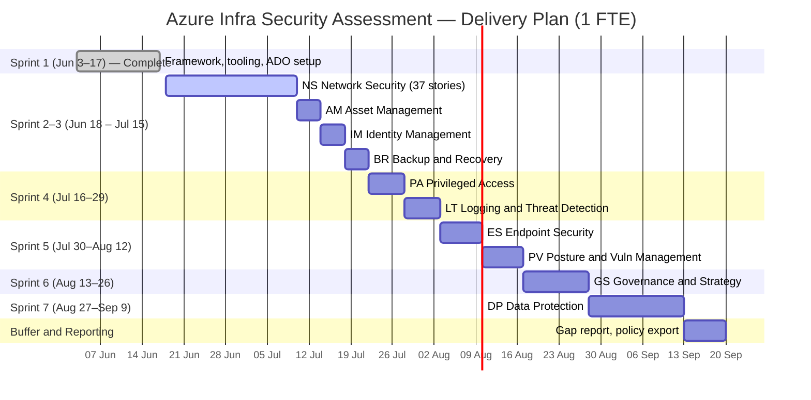

[[_TOC_]]

# Azure Infrastructure Security Gap Assessment — Delivery Approach

## Executive Summary

This wiki documents the approach used to build a structured Azure Infrastructure Security Gap Assessment based on the Microsoft Cloud Security Benchmark (MCSB) v2 and v3 frameworks. The assessment has been decomposed into **10 active security domains** (IR and DS features closed — infra scope only), resulting in a refined effort model validated against industry benchmarks and filtered for active infrastructure services.

**Current effort estimate: 485h / 60.6 working days** across 10 active domains (1 FTE sequential assumption; see Section 8 for domain breakdown and Section 9 for delivery schedule).

**Audience**: team management, engineering leads, and security stakeholders preparing delivery planning and sprint allocation.

---

## Assessment Scope

### Source Frameworks

| Framework | Version | Content |
|---|---|---|
| MCSB | v2 | 85 benchmark controls, resource-agnostic, 12 security domains |
| MCSB | v3 (per-service) | 118 Azure service baselines, ~35 feature rows each, 4,157 total rows |

### Security Domains in Scope

| Code | Domain | Status |
|---|---|---|
| NS | Network Security | Active |
| IM | Identity Management | Active |
| PA | Privileged Access | Active |
| DP | Data Protection | Active |
| AM | Asset Management | Active |
| LT | Logging and Threat Detection | Active |
| PV | Posture and Vulnerability Management | Active |
| ES | Endpoint Security | Active |
| BR | Backup and Recovery | Active |
| GS | Governance and Strategy | Active |
| IR | Incident Response | **Closed — out of infra scope** |
| DS | DevOps Security | **Closed — out of infra scope** |

### Work Item Totals (Active Scope)

- **10 Features** — one per active security domain (IR and DS ADO features closed)
- **~145 User Stories** — MCSB controls mapped per resource (152 − IR 4 − DS 6 = 142 approx)
- **~4,157 Tasks** (planned) — one per v3 control-feature row (NS filtered; other domains pending infra filter)

### Infrastructure Service Filter

NS domain re-estimated after removing services confirmed absent from infrastructure:

> Batch, Communication Services, Communications Gateway, Container Apps, Digital Twins, HPC Cache, Machine Learning Service, Managed Lustre, Nutanix on Azure, Remote Rendering, SignalR Service, Spring Apps, Stack Edge, VMware Solution, Web PubSub

Same filter will be applied to remaining domains once excluded service list is confirmed per domain.

### Framework Relationship


---

## ADO Work Item Hierarchy

### Design Decision

| Work Item Type | Count | Maps To |
|---|---|---|
| **Feature** | 10 | Active security domain (NS, IM, PA, DP, AM, LT, PV, ES, BR, GS) |
| **User Story** | ~142 | MCSB control instance per Azure resource |
| **Task** | ~4,157 | Script or manual check per v3 control-feature row |

### Rationale

- **Domain = Feature**: 10 active domains fit at Feature level. Epics would add unnecessary nesting for a single-team engagement. Feature-level granularity gives management visibility per security domain on the ADO board.
- **Control = User Story**: Each user story represents one auditable control for one Azure resource. Stories carry acceptance criteria (policy confirmed / uncertain / gap) making done-criteria explicit.
- **Feature row = Task**: Each row in the v3 per-service xlsx is one verifiable check (scripted or manual). Tasks are generated from `v3_service_controls_reclassified.csv`.

### Feature Naming Convention

```
Security Domain #N: {Name} ({CODE}) Baselines
```

Example: `Security Domain #1: Network Security (NS) Baselines`

---

## v2 → v3 Mapping Approach

### Framework Definitions

- **MCSB v2**: 85 benchmark controls in a single definition file (`azure-security-benchmark-v3.0.xlsx`). Resource-agnostic — defines *what* to check, not *how* per service.
- **MCSB v3**: 118 per-service baseline files (one per Azure service). Each file has a "Feature Summary" sheet with rows mapping back to v2 control IDs via the `asb_control_id` field (same ID scheme: NS-1, AM-3, etc.).

### Story Types

| Type | Count | % | Definition |
|---|---|---|---|
| Combined v2+v3 | 118 | 74% | v2 control with ≥1 Azure resource having v3 data |
| Pure v2 | 42 | 26% | v2 control with no v3 resource baseline (process/org controls) |

### Mapping Key

`v2 control_id` = `asb_control_id` in v3 xlsx. Same identifier across both versions (e.g., `NS-1`, `AM-3`, `ES-2`). This shared key enables exact join without fuzzy matching at the control level.

### Source Files

- v3 xlsx source: `MicrosoftDocs/SecurityBenchmarks / Azure Offer Security Baselines / 3.0`
- Downloaded and cached locally: `data/inputs/v3_baselines/` (118 files, gitignored — tenant-adjacent data)
- Merged output: `data/outputs/v3_service_controls_raw.csv` (4,157 rows)

---

## User Story Structure

### Format

Stories use ADO-native markdown. Not BDD (Given/When/Then removed by design — assessment framing, not enforcement framing).

### Story Title

```
[SEC-N] Control Title: Resource Name
```

Example: `[SEC-1] Network Segmentation: Azure Kubernetes Service`

### Story Fields

| Field | Content |
|---|---|
| **Title** | `[SEC-N] {control}: {resource}` |
| **Description** | 3–4 sentences, assessment tone (audits WHERE gaps exist, not mandates compliance) |
| **Acceptance Criteria** | Option A / B / C based on policy status |
| **Tags** | `Security`, domain code (e.g. `NS`) |


### Assessment Tone Rationale

Stories use assessment language ("audit and identify WHERE the environment deviates from stated standards") rather than enforcement language ("enforces", "mandates", "blocks"). This reflects the engagement goal: gap identification, not remediation enforcement.

---

## v3 Per-Service Baseline Analysis

### Source

- Repository: `MicrosoftDocs/SecurityBenchmarks`
- Path: `Azure Offer Security Baselines/3.0`
- 118 `.xlsx` files — one per Azure service

### "Feature Summary" Sheet Schema (Currentl Reworking. In Progreess. TBC)

| Column | Description |
|---|---|
| ASB Control ID | Control identifier (e.g. ES-1, AM-3) |
| Responsibility | Customer / Microsoft / Shared / Not Applicable |
| Feature Supported | True / False / Not Applicable |
| Feature Enabled by Default | True / False / Not Applicable |
| Feature Reference | URL to Azure docs |

### Phase 35: Applicability Breakdown (Mechanical — Excel field proxy) (Currentl Reworking. In Progreess. TBC)

| Applicability | Rows | % |
|---|---|---|
| not_applicable | 2,861 | 69% |
| customer | 905 | 22% |
| microsoft_managed | 367 | 9% |
| shared | 24 | 1% |

### Phase 37: Qwen3 Reclassification (Complete) (Deprecated)

34 unique `asb_control_id` values analyzed by Qwen3 local LLM (`qwen3:30b-a3b`). Verdicts propagated to all 4,157 rows. Key results:

| Metric | Value |
|---|---|
| Controls analyzed | 34 / 34 |
| Newly applicable flips (N/A → customer) | 1,398 rows |
| script_simple controls | 1,148 rows |
| script_medium controls | 1,154 rows |
| manual_only controls | 1 row (PV-7 only) |

Reclassification applied 2025 Azure capability knowledge and third-party tool awareness (Defender for Storage blob malware scanning, ClamAV, Broadcom CWP, etc.) to correct the mechanical Phase 35 classification which missed newly-available capabilities.

---

## Effort Estimation Methodology

### Industry Benchmark

Research against published security assessment benchmarks:

- Industry norm: **4–6 hours per control** for MCSB-class assessments
- Total range for this class of assessment: **600–1,000 hours**
- Our calibrated estimate (485h) is below the low end, reflecting: (a) infra-scope exclusions (IR, DS, 15 absent services) and (b) automation leverage from script_simple/script_medium controls

### Effort Formula (Currentl Reworking. In Progreess. TBC)

| automation_class | policy_status | Hours |
|---|---|---|
| script_simple | confirmed | 2h |
| script_simple | uncertain / none | 3h |
| script_medium | confirmed | 3h |
| script_medium | uncertain / none | 4h |
| manual_only | confirmed | 4h |
| manual_only | uncertain | 5h |
| manual_only | none | 7h |
| not_applicable | any | 0.5h |

### Matching Strategy (Currentl Reworking. In Progreess. TBC)

Story `resource` field (e.g. "Bot Service") is fuzzy-matched to v3 `service_name` (e.g. "azure-bot-service") using `rapidfuzz.token_sort_ratio` with threshold 60. Noise words ("azure", "microsoft", "service") normalised before matching.

- NS domain: 35 of 37 active stories matched to v3 data; 2 used fallback
- Other domains: pending infra-filter pass (same script pattern)

---

## Current Effort Estimates (Currentl Reworking. In Progreess. TBC)

**Revised estimate: 485h / 60.6 working days** (8h/day, 1 FTE sequential)

Scope reductions applied:
- IR (Incident Response) — **closed, out of infra scope** (−19h)
- DS (DevOps Security) — **closed, out of infra scope** (−42h)
- NS infra filter — 15 absent services excluded (−63h, from 187h → 124h)

| Domain | Active Stories | Hours | Days | Notes |
|---|---|---|---|---|
| NS | 37 | 124 | 15.5 | Filtered (15 services excluded) |
| DP | 28 | 91 | 11.4 | Infra filter pending |
| GS | 10 | 60 | 7.5 | Infra filter pending |
| ES | 14 | 39 | 4.9 | Infra filter pending |
| PV | 7 | 38 | 4.8 | Infra filter pending |
| LT | 7 | 36 | 4.5 | Infra filter pending |
| PA | 7 | 34 | 4.2 | Infra filter pending |
| IM | 7 | 23 | 2.9 | Infra filter pending |
| BR | 4 | 21 | 2.6 | Infra filter pending |
| AM | 6 | 19 | 2.4 | Infra filter pending |
| IR | — | — | — | **Closed** |
| DS | — | — | — | **Closed** |
| **TOTAL** | **~127** | **485** | **60.6** | NS filtered; others at Phase 37 estimate |

> **Note**: Remaining 9 domains carry Phase 37 estimates (no infra filter applied yet). As excluded services are confirmed per domain, hours will decrease further.

---

## Delivery Schedule

### Sprint Cadence

- 2-week sprints
- Sprint 1: Jun 3–17, 2026 (complete — framework, tooling, ADO setup)
- Sprint 2 starts: Jun 18, 2026

### Assumption

Sequential 1 FTE. If parallel execution or additional engineers are allocated, all domain durations compress proportionally.

### Sprint Schedule



### Domain-Sprint Mapping

| Sprint | Dates | Domains | Hours |
|---|---|---|---|
| 1 (done) | Jun 3–17 | Framework + ADO setup | — |
| 2 | Jun 18–Jul 1 | NS (partial, 80h) | 80 |
| 3 | Jul 2–15 | NS (complete, 44h) + AM + IM + BR | 44+19+23+21=107 → spans into S4 |
| 3–4 | Jul 2–29 | AM + IM + BR + PA + LT (combined ~133h) | 133 |
| 5 | Jul 30–Aug 12 | ES + PV | 77 |
| 6 | Aug 13–26 | GS | 60 |
| 7 | Aug 27–Sep 9 | DP (partial, 80h) | 80 |
| 8 | Sep 10–13 | DP (complete, 11h) + reporting | 11+~35 |

**Projected completion: mid-September 2026** (1 FTE sequential)

---

## Known Gaps and Next Steps

### Immediate

- **Infra filter — remaining domains**: Confirm excluded services for DP, GS, ES, PV, LT, PA, IM, BR, AM. Each filter pass expected to reduce estimate ~10–20%.
- **ADO Import**: Run `scripts/import_to_ado.py` once `ADO_PAT` is set. Creates all 10 Features + ~142 User Stories with parent links. Dry-run mode available.

### Pending Engineering

- **Task Generation**: ~4,157 v3 rows → ADO Tasks under each User Story. Script not yet written. Source data available: `data/outputs/v3_service_controls_reclassified.csv`.
- **Script Development**: Begin with `script_simple` controls — Azure CLI / REST reads only, fastest ROI, lowest risk.

### Priority Order for Script Development

1. `script_simple + confirmed` → 2h each — verified policy + simple state check
2. `script_simple + uncertain` → 3h each — simple check, policy to be verified
3. `script_medium + confirmed` → 3h each — multi-step but policy exists as reference

### Manual Review Allocation

`manual_only` controls require senior engineer time (no API exposure). Only PV-7 is classified `manual_only` post Phase 37 reclassification. Allocate ~7h for this control separately.

---

## Appendix: Key Files

| File | Description |
|---|---|
| `ado/features.md` | 10 active Feature definitions (assessment-tone, PA template) |
| `ado/user_stories/*.md` | Domain user story files (ns, im, pa, dp, am, lt, pv, es, br, gs) |
| `scripts/parse_stories.py` | Parses .md files → `scripts/ado_stories.csv` |
| `scripts/import_to_ado.py` | Two-pass ADO REST API import (Features then Stories) |
| `scripts/audit_policy_coverage.py` | Classifies policy_status per story |
| `scripts/download_v3_baselines.py` | Downloads 118 v3 xlsx files from GitHub |
| `scripts/review_v3_controls.py` | Phase 35 mechanical classification |
| `scripts/reclassify_v3_controls.py` | Phase 37 Qwen3 intelligent reclassification (complete) |
| `scripts/estimate_effort_v3.py` | Effort estimation with v3 data (all domains baseline) |
| `scripts/estimate_effort_ns_filtered.py` | Phase 39 NS filtered estimate (infra exclusions applied) |
| `data/outputs/v3_service_controls_reclassified.csv` | 4,157 rows, Qwen3-classified |
| `data/outputs/effort_estimates_v3_revised.csv` | Phase 37 revised estimate (609h → superseded by scope reductions) |
| `data/outputs/effort_estimates_ns_filtered.csv` | NS filtered estimate: 124h / 15.5 days |
